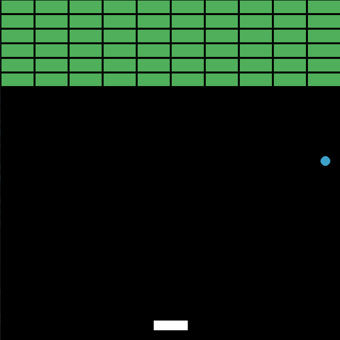
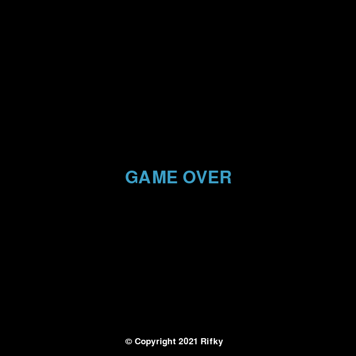

<h1 align="center">Breakout-KD</h1>

### About This Game

Breakout-KD is a fantastic breakout game. It's a python based game officialy made by me on december holiday. This game works on `Windows 7/8/10/11` & all windows platforms.

### REQUIREMENTS :
- First make sure new version [**Python**](https://www.python.org/) installed in your system
- I made this game on pygame module. So, Install [**pygame**](https://www.pygame.org/news) on your system
```
pip install pygame
```
- To compile python file to exe we want to install [**pyinstaller**](https://www.pyinstaller.org/) & [**auto-py-to-exe**](https://pypi.org/project/auto-py-to-exe/) modules
```
pip install pyinstaller
```
```
pip install auto-py-to-exe
```
## Screenshots



## Instalation & Usage
- If you have installed [**git**](https://git-scm.com/downloads) on your system, you can clone this
  - ```git clone https://github.com/rifkykd/Breakout-KD```
  - ```cd Breakout-KD```
  - ```python breakout_kd.py```
- Otherwise you can download this as [**Zip file**](https://github.com/rifkykd/Breakout-KD/archive/refs/heads/main.zip)
  - Extract it
  -  ```cd Breakout-KD```
  - ```python breakout_kd.py```

## Make it executable
### Method 1 :
- Open cmd & go to file path 
- type 
``` 
pyinstaller --onefile breakout_kd.py
```
- Now you can see some new folders. Open ```dist``` folder and you can find ```breakout_kd.exe``` on it 
### Method 2 :
- Open cmd & type
```
auto-py-to-exe
```
- Browse your file path 
- select ```--onefile``` & click on ```Convert```
- Now you can see some new folders. Open ```dist``` folder and you can find ```breakout_kd.exe``` on it 

<b>Note</b> :- <i>Make sure requirments installed on your system correctly </i>

<h2 align="center"><b>100% WORKING</b></h2>
<h2 align="center"><b>Enjoy 🥳 </b></h2>

### This Tool Was Developed By :

- [**Rifky**](https://github.com/rifkykd)
<h3 align="left">Connect with me</h3>
<a href="https://twitter.com/Rifky54641898">
  
</a>
<a href="https://www.instagram.com/rifky__kd/">
  
</a>
<a href="https://github.com/rifkykd">
  
</a>
<a href="href="https://www.tiktok.com/@rifky_kd?lang=en">
  
</a>
<a href="https://www.youtube.com/channel/UCFu0H_KJJG_JiHH-8JOWjOA" target="blank">
  
</a>
<a href="https://t.me/@rifky_kd" target="blank">
  
</a>
<br>
<br>                                                                                                                
<p>

</p>
